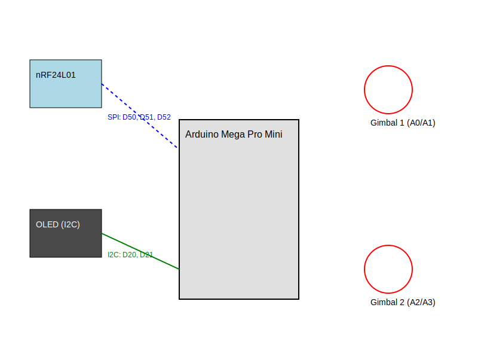
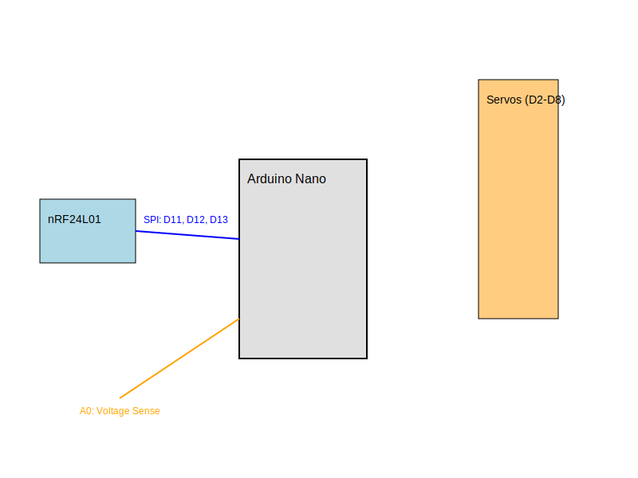

# ⚓ AVRRC: Open-Source RC Control System
**High-resolution, low-latency control for boats and modular models.**

AVRRC is a custom-engineered 2.4GHz radio system built for the Arduino ecosystem. It focuses on precision control, robust telemetry, and modular hardware configurations.

---

## 🎮 Transmitter (TX) Configurations

### Option A: Standard TX (Arduino Nano)
*Optimized for lightweight, compact handheld operation.*


| Component | Pin | Type | Logic / Function |
| :--- | :--- | :--- | :--- |
| **Joystick 1 (X)** | `A0` | Analog | Steering / Rudder |
| **Joystick 1 (Y)** | `A1` | Analog | Throttle / Left Motor |
| **Button A** | `D2` | Digital | Ch 5 (Hold at boot to Calibrate) |
| **Mixer Switch** | `D4` | Digital | **GND** = Tank Mixing ON |
| **Radio SPI** | `D11-D13`| SPI | MOSI (11), MISO (12), SCK (13) |

### Option B: Advanced TX (Arduino Mega 2560)
*The "Stealth Brick" configuration: OLED Dashboard and Multi-Model Memory.*


| Component | Pin | Function |
| :--- | :--- | :--- |
| **Gimbal 1 (X/Y)** | `A0` / `A1` | Primary Steering & Throttle |
| **Gimbal 2 (X/Y)** | `A2` / `A3` | Auxiliary / Pan-Tilt / Yaw |
| **Trim Select** | `D8` | Cycles through CH1 - CH4 for tuning |
| **Trim (+ / -)** | `D6` / `D7` | Adjusts software center of selected channel |
| **Button A** | `D2` | Ch 5 (Hold at boot for Calibration) |
| **Button B** | `D3` | Ch 6 (Hold at boot for Model Selection) |
| **Mixer Switch** | `D4` | **GND** = Dual-Motor Tank Mixing ON |
| **Buzzer (+)** | `D5` | Audible feedback and nautical alarms |
| **TX Batt Sense**| `A15` | Voltage monitor (10k/10k divider) |
| **OLED I2C** | `20` / `21` | SDA (20) / SCL (21) |
| **Radio SPI** | `50-52` | MISO (50), MOSI (51), SCK (52) |

---

## ⚓ Receiver Connection Map (Arduino Nano / Uno)

The receiver manages the 2.4GHz link, monitors the main battery, and drives up to 7 servos or ESCs.

### 🔌 Servo & ESC Outputs (Channels 1-7)


| Arduino Pin | Payload Channel | Typical Application |
| :--- | :--- | :--- |
| **D2** | `ch1` | Rudder Servo (Steering) |
| **D3** | `ch2` | Main Motor ESC (Throttle) |
| **D4** | `ch3` | Secondary Motor ESC (Mixer) |
| **D5** | `ch4` | Auxiliary Servo 1 (Yaw/Pan) |
| **D6** | `ch5` | Auxiliary Servo 2 (Tilt) |
| **D7** | `ch6` | Digital Switched Output 1 |
| **D8** | `ch7` | Digital Switched Output 2 |

### 🛠️ Sensors & Indicators


| Arduino Pin | Function | Wiring Note |
| :--- | :--- | :--- |
| **A0** | **Voltage Sense** | Center tap of 10k/4.7k divider (Max 15V) |
| **A1** | **Failsafe / Bind** | Connect to GND to Bind at boot |
| **A2** | **Status LED** | Connect to LED (+) via 220Ω resistor |

### 📡 nRF24L01+ Radio (Hardware SPI)


| nRF24 Pin | Arduino Nano Pin | Wiring Note |
| :--- | :--- | :--- |
| **VCC** | **3.3V** | **CRITICAL: DO NOT USE 5V** |
| **GND** | **GND** | Common ground with Nano |
| **CE** | **D9** | |
| **CSN** | **D10** | |
| **SCK** | **D13** | Hardware SPI Clock |
| **MOSI** | **D11** | Hardware SPI Data In |
| **MISO** | **D12** | Hardware SPI Data Out |

> [!CAUTION]
> **Timer Conflict:** On the Arduino Nano/Uno, using the `Servo` library disables `analogWrite()` (PWM) on **Pins 9 and 10**. This is perfectly fine for your build as these pins are used for the radio's `CE` and `CSN` signals.

---

## 📡 Radio Module (nRF24L01) Pinout

> [!WARNING]
> **VCC MUST be 3.3V.** Connecting the nRF24L01 to 5V will permanently damage the module.

### Common Power Pins


| nRF Pin | Arduino Pin | Note |
| :--- | :--- | :--- |
| **GND** | **GND** | Common Ground |
| **VCC** | **3.3V** | **MAX 3.6V** |
| **CE** | **D9** | Chip Enable |
| **CSN** | **D10** | Chip Select |

### Platform Data Pins


| Function | Arduino Nano (RX/TX) | Arduino Mega (Advanced TX) |
| :--- | :--- | :--- |
| **SCK** (Clock) | `D13` | `D52` |
| **MOSI** | `D11` | `D51` |
| **MISO** | `D12` | `D50` |

---

## ⚓ Standardized Channel Map (Mode 2)

To ensure consistent operation, AVRRC follows the industry-standard **Mode 2** gimbal layout. This ensures that movement logic remains on the Left Stick while the Right Stick is reserved for secondary controls.

### 🕹️ Transmitter Input Layout
*   **Left Stick (X-Axis):** Yaw (Rudder / Steering)
*   **Left Stick (Y-Axis):** Throttle (Forward/Reverse)
*   **Right Stick (X-Axis):** Auxiliary 1 (Pan / Camera / Accessories)
*   **Right Stick (Y-Axis):** Auxiliary 2 (Tilt / Lights / Crane)

### 🔌 Receiver Output Mapping

| Channel | Standard Mode (Mixer OFF) | Tank Mode (Mixer ON) |
| :--- | :--- | :--- |
| **CH1** | Rudder Servo | Rudder Servo (Inactive) |
| **CH2** | Main Motor ESC | **Left Motor ESC** |
| **CH3** | Auxiliary Servo 1 | **Right Motor ESC** |
| **CH4** | Auxiliary Servo 2 | Auxiliary Servo 2 |
| **CH5** | Button A (Digital) | Button A (Digital) |
| **CH6** | Button B (Digital) | Button B (Digital) |
| **CH7** | Mixer OFF (0) | Mixer ON (255) |

> [!TIP]
> **Tank Mode Logic:** When the Mixer Switch (D4) is grounded, the Left Stick's Throttle and Steering are combined to drive CH2 and CH3. This allows you to drive a dual-motor boat entirely with your left thumb.

---

## 🚀 Operational Guide

### ⚖️ Auto-Calibration
To map your joysticks to the full 0–255 software resolution:
1. **Hold Button A (D2)** while powering on the transmitter.
2. Move both sticks in their full range of motion for 5 seconds.
3. Limits are automatically saved to EEPROM and persist after power-down.

### ⚙️ Stealth Trims
Adjust your model's center-point without looking at the screen:
1. Press **Trim Select (D8)** to cycle through Channels 1-4 (indicated by buzzer tones).
2. Use **Trim +/- (D6/D7)** to nudge the center.
3. Values save automatically after 5 seconds of inactivity.

### 🛥️ Model Memory (Mega Only)
Manage up to **20 independent boat profiles**:
*   **Switching:** Hold **Button B (D3)** at power-on. Tap Button B within 5 seconds to cycle profiles.
*   **Renaming:** Connect via USB, open Serial Monitor (9600 baud), and type a name (Max 11 chars).

### 📶 Telemetry & Links
The Advanced TX dashboard provides live diagnostics:
*   **RX BATT:** Real-time boat battery voltage via ACK-Payload.
*   **TX BATT:** Transmitter battery health (A15 sense).
*   **LINK:** Signal quality (%) based on packet success rate.

---

## 🛡️ Hardware Safety & Requirements

1.  **Radio Power:** The nRF24L01 **MUST** use **3.3V**.
2.  **Decoupling Capacitor:** Solder a **10µF to 100µF capacitor** directly across the radio's `VCC` and `GND` pins.
3.  **Common Ground:** The boat battery, Arduino, and ESCs **MUST** share a common **GND**.

### 📦 Required Libraries
*   **RF24** (by TMRh20)
*   **U8g2** (by oliver) - *Mega TX only*
*   **Servo** (Built-in)

---

## ⚡ Battery Telemetry (Voltage Dividers)

Both the Transmitter and Receiver monitor battery health using Voltage Dividers. These scale high battery voltages down to the 0–5V range for the Arduino analog pins.

### 🛥️ Receiver (RX) Telemetry
Designed for up to **3S LiPo (12.6V)**.
*   **Resistors:** R1 = 10kΩ | R2 = 4.7kΩ
*   **Multiplier:** `3.127`
*   **Formula:** `(10000 + 4700) / 4700 = 3.127`

### 🎮 Transmitter (TX) Telemetry
Designed for **2S LiPo/Li-ion (8.4V)**.
*   **Resistors:** R1 = 10kΩ | R2 = 10kΩ
*   **Multiplier:** `2.0`
*   **Formula:** `(10000 + 10000) / 10000 = 2.0`

### 🛠️ Wiring Diagram (Universal)
```text
       [ Battery (+) ] 


              |
          [ 10kΩ ] (R1)
              |
Pin <---------+--- (Tap to A0/A15)

              |
          [ R2 ] (4.7k or 10k)
              |
       [ Common GND ]
```
>[!WARNING]
>Common Ground: You MUST connect the Battery Negative (-) to the Arduino GND. 
>Without this common reference, the telemetry readings will be erratic or zero.

## 🏷️ Model Renaming (USB)
Renaming applies to the **currently active** model index. All names are limited to **11 characters**.

### ⌨️ Terminal Commands
*   **Arduino Serial Monitor:** 9600 Baud | Line ending set to **Newline**.
*   **Linux CLI:** `stty -F /dev/ttyUSB0 9600 raw && echo "BOATNAME" > /dev/ttyUSB0`
*   **PuTTY:** Serial | 9600 | Category > Terminal > Check "Implicit LF on every CR".
*   **Screen:** `screen /dev/ttyUSB0 9600` (Use `Ctrl+J` to send the required Line Feed).

---

## 🔋 Power Systems & Recommendations


| Setup | Recommended Battery | Why? |
| :--- | :--- | :--- |
| **Transmitter** | **2S (7.4V) Li-ion or LiPo** | Stable voltage for hours of operation; easy to regulate. |
| **Receiver (2S)** | **7.4V LiPo** | Ideal for standard scale boats and servos. |
| **Receiver (3S)** | **11.1V LiPo** | Necessary for high-speed brushless motor "punch." |

*   **Wiring:** Connect battery to **VIN** on Arduino (7-12V safe range).
*   **Servos:** Use a dedicated **BEC** (Battery Eliminator Circuit) for high-load servos to prevent MCU brown-outs.

---

## 🪵 The "Stealth Brick" Enclosure

Custom 10-layer plywood enclosure designed for nautical ergonomics and industrial durability.

*   **Material:** 10 layers of **1/4" (6.35mm) Plywood**.
*   **Construction:** Layers 3-9 are hollowed for internal electronics.
*   **Nautical Finish:** Through-bolted 5" boat cleat acts as a handle and antenna roll-cage.

### 📐 Faceplate Template (SVG)

<p align="center">
  
</p>

<details>
<summary>Click to view SVG Source Code</summary>

```xml
<svg width="800" height="700" viewBox="0 0 800 700" xmlns="http://w3.org">
  <!-- Stealth Perimeter -->
  <path d="M 150,50 L 650,50 L 750,150 L 750,550 L 650,650 L 150,650 L 50,550 L 50,150 Z" fill="none" stroke="black" stroke-width="3"/>
  <!-- Gimbals -->
  <circle cx="210" cy="480" r="85" fill="none" stroke="red" stroke-width="2"/>
  <circle cx="590" cy="480" r="85" fill="none" stroke="red" stroke-width="2"/>
  <!-- OLED -->
  <rect x="330" y="100" width="140" height="90" fill="none" stroke="blue" stroke-width="2"/>
  <!-- Trims -->
  <circle cx="330" cy="220" r="15" fill="none" stroke="purple" stroke-width="2"/>
  <circle cx="400" cy="220" r="15" fill="none" stroke="purple" stroke-width="2"/>
  <circle cx="470" cy="220" r="15" fill="none" stroke="purple" stroke-width="2"/>
  <!-- Functions -->
  <circle cx="340" cy="400" r="15" fill="none" stroke="green" stroke-width="2"/>
  <circle cx="460" cy="400" r="15" fill="none" stroke="green" stroke-width="2"/>
</svg>
```

## 🎮 Transmitter Schematic (Advanced TX)

### 📐 Transmitter Schematic (SVG)

<p align="center">
  
</p>

<details>
<summary>Click to view SVG Source Code</summary>

```xml
<svg xmlns="http://www.w3.org/2000/svg" xmlns:xlink="http://www.w3.org/1999/xlink" width="1000" height="850" viewBox="0 0 1000 850">
  <rect width="100%" height="100%" fill="#ffffff"/>
  <rect x="350" y="200" width="300" height="450" rx="10" ry="10" fill="#e0e0e0" stroke="#000000" stroke-width="2"/>
  <text x="410" y="240" font-family="Arial" font-size="18" font-weight="bold">Mega 2560 Pro Mini</text>
  <rect x="50" y="50" width="160" height="100" rx="5" ry="5" fill="#add8e6" stroke="#000000"/>
  <text x="65" y="80" font-family="Arial" font-size="14" font-weight="bold">nRF24L01+</text>
  <path d="M 210 100 L 350 250" fill="none" stroke="#0000ff" stroke-width="2" stroke-dasharray="4"/>
  <text x="220" y="150" font-family="Arial" font-size="12" fill="#0000ff">SPI: 50, 51, 52, 9, 10</text>
  <circle cx="150" cy="350" r="60" fill="#ffe0e0" stroke="#000000"/><text x="100" y="430" font-family="Arial" font-size="12">Left Gimbal (A0/A1)</text>
  <circle cx="850" cy="350" r="60" fill="#ffe0e0" stroke="#000000"/><text x="800" y="430" font-family="Arial" font-size="12">Right Gimbal (A2/A3)</text>
  <rect x="425" y="50" width="150" height="80" rx="5" ry="5" fill="#4a4a4a" stroke="#000000"/><text x="445" y="80" font-family="Arial" font-size="14" font-weight="bold" fill="#ffffff">OLED (I2C)</text>
  <path d="M 500 130 L 500 200" fill="none" stroke="#008000" stroke-width="2"/>
  <g fill="#90ee90" stroke="#000000">
    <circle cx="100" cy="550" r="20"/><text x="130" y="555" font-family="Arial" font-size="12">Trim Select (D8)</text>
    <circle cx="100" cy="600" r="20"/><text x="130" y="605" font-family="Arial" font-size="12">Trim + (D6)</text>
    <circle cx="100" cy="650" r="20"/><text x="130" y="655" font-family="Arial" font-size="12">Trim - (D7)</text>
    <circle cx="900" cy="550" r="20"/><text x="780" y="555" font-family="Arial" font-size="12">Button A (D2)</text>
    <circle cx="900" cy="600" r="20"/><text x="780" y="605" font-family="Arial" font-size="12">Button B (D3)</text>
    <rect x="880" y="630" width="40" height="40"/><text x="770" y="655" font-family="Arial" font-size="12">Mixer Sw (D4)</text>
    <circle cx="500" cy="730" r="20"/><text x="460" y="770" font-family="Arial" font-size="12">Buzzer (D5)</text>
  </g>
  <rect x="750" y="50" width="120" height="60" fill="#fffacd" stroke="#000000"/><text x="760" y="85" font-family="Arial" font-size="12">10k/10k Tap (A15)</text>
</svg>
```

## 🎮 Receiver Schematic (Nano)

This shows how the Arduino Nano distributes signals to your 7 Servo Channels.

### 📐 Receiver Schematic (SVG)

<p align="center">
  
</p>

<details>
<summary>Click to view SVG Source Code</summary>

```xml
<svg xmlns="http://www.w3.org/2000/svg" xmlns:xlink="http://www.w3.org/1999/xlink" width="1000" height="850" viewBox="0 0 1000 850">
  <rect width="100%" height="100%" fill="#ffffff"/>
  
  <!-- ARDUINO NANO -->
  <rect x="350" y="250" width="200" height="400" rx="10" fill="#e0e0e0" stroke="#333" stroke-width="3"/>
  <text x="400" y="290" font-family="Arial" font-size="20" font-weight="bold">Arduino Nano</text>
  
  <!-- NRF24L01+ MODULE -->
  <rect x="50" y="100" width="180" height="120" rx="5" fill="#add8e6" stroke="#005b96" stroke-width="2"/>
  <text x="70" y="135" font-family="Arial" font-size="16" font-weight="bold">nRF24L01+</text>
  <circle cx="210" cy="120" r="10" fill="#ff4444"/> <!-- Antenna Port -->
  <text x="65" y="180" font-family="Arial" font-size="12">SPI: 11, 12, 13</text>
  <text x="65" y="200" font-family="Arial" font-size="12">CE: 9 | CSN: 10</text>
  
  <!-- DECOUPLING CAPACITOR -->
  <rect x="240" y="140" width="30" height="40" fill="#888" stroke="#333"/>
  <text x="230" y="130" font-family="Arial" font-size="10">10uF-100uF</text>
  
  <!-- SERVO / ESC RAIL (7 CHANNELS) -->
  <rect x="700" y="100" width="250" height="550" rx="5" fill="#ffe0b2" stroke="#e65100" stroke-width="2"/>
  <text x="740" y="135" font-family="Arial" font-size="18" font-weight="bold">Servo/ESC Rail</text>
  <g font-family="Arial" font-size="12" fill="#333">
    <text x="720" y="180">D2: CH1 (Rudder)</text>
    <text x="720" y="230">D3: CH2 (Throttle/L)</text>
    <text x="720" y="280">D4: CH3 (Aux/R Motor)</text>
    <text x="720" y="330">D5: CH4 (Yaw/Pan)</text>
    <text x="720" y="380">D6: CH5 (Tilt)</text>
    <text x="720" y="430">D7: CH6 (Digital A)</text>
    <text x="720" y="480">D8: CH7 (Mixer Status)</text>
  </g>

  <!-- SENSORS & STATUS -->
  <g stroke="#333" stroke-width="2">
    <!-- LED -->
    <circle cx="150" cy="400" r="15" fill="#ff4444"/>
    <text x="110" y="440" font-family="Arial" font-size="12">Status LED (A2)</text>
    
    <!-- BIND JUMPER -->
    <rect x="130" y="500" width="40" height="30" fill="#90ee90"/>
    <text x="90" y="550" font-family="Arial" font-size="12">Bind Jumper (A1)</text>
    
    <!-- VOLTAGE DIVIDER -->
    <rect x="110" y="620" width="100" height="60" fill="#fffacd"/>
    <text x="115" y="640" font-family="Arial" font-size="11">R1: 10k | R2: 4.7k</text>
    <text x="120" y="660" font-family="Arial" font-size="12" font-weight="bold">Volt Tap (A0)</text>
  </g>

  <!-- WIRING BUS LINES -->
  <path d="M 230 160 L 350 350" fill="none" stroke="#005b96" stroke-width="2" stroke-dasharray="5,3"/> <!-- Radio Bus -->
  <path d="M 700 350 L 550 450" fill="none" stroke="#e65100" stroke-width="2"/> <!-- Servo Bus -->
  <path d="M 210 650 L 350 600" fill="none" stroke="#fbc02d" stroke-width="2"/> <!-- Voltage line -->

</svg>
```

