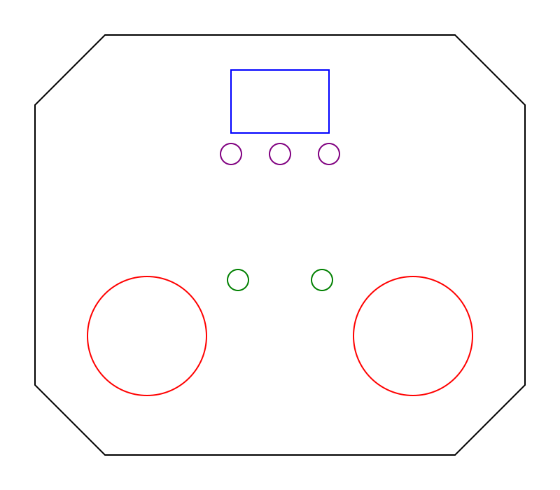

# ⚓ AVRRC: Open-Source RC Control System
**High-resolution, low-latency control for boats and modular models.**

AVRRC is a custom-engineered 2.4GHz radio system built for the Arduino ecosystem. It focuses on precision control, robust telemetry, and modular hardware configurations.

---

## 🎮 Transmitter (TX) Configurations

### Option A: Standard TX (Arduino Nano)
*Optimized for lightweight, compact handheld operation.*


| Component | Pin | Type | Logic / Function |
| :--- | :--- | :--- | :--- |
| **Joystick 1 (X)** | `A0` | Analog | Steering / Rudder |
| **Joystick 1 (Y)** | `A1` | Analog | Throttle / Left Motor |
| **Button A** | `D2` | Digital | Ch 5 (Hold at boot to Calibrate) |
| **Mixer Switch** | `D4` | Digital | **GND** = Tank Mixing ON |
| **Radio SPI** | `D11-D13`| SPI | MOSI (11), MISO (12), SCK (13) |

### Option B: Advanced TX (Arduino Mega 2560)
*The "Stealth Brick" configuration: OLED Dashboard and Multi-Model Memory.*


| Component | Pin | Function |
| :--- | :--- | :--- |
| **Gimbal 1 (X/Y)** | `A0` / `A1` | Primary Steering & Throttle |
| **Gimbal 2 (X/Y)** | `A2` / `A3` | Auxiliary / Pan-Tilt / Yaw |
| **Trim Select** | `D8` | Cycles through CH1 - CH4 for tuning |
| **Trim (+ / -)** | `D6` / `D7` | Adjusts software center of selected channel |
| **Button A** | `D2` | Ch 5 (Hold at boot for Calibration) |
| **Button B** | `D3` | Ch 6 (Hold at boot for Model Selection) |
| **Mixer Switch** | `D4` | **GND** = Dual-Motor Tank Mixing ON |
| **Buzzer (+)** | `D5` | Audible feedback and nautical alarms |
| **TX Batt Sense**| `A15` | Voltage monitor (10k/10k divider) |
| **OLED I2C** | `20` / `21` | SDA (20) / SCL (21) |
| **Radio SPI** | `50-52` | MISO (50), MOSI (51), SCK (52) |

---

## ⚓ Receiver (RX) Configuration
*Supports all 7 channels with integrated failsafe logic.*


| Pin | Function | Typical Connection |
| :--- | :--- | :--- |
| `D2` | **Channel 1** | Rudder Servo |
| `D3` | **Channel 2** | Main ESC / Left Motor |
| `D4` | **Channel 3** | Aux Servo / Right Motor |
| `A0` | **Volt Sense** | 10k/4.7k Divider (3.127x Multiplier) |
| `A1` | **Failsafe** | **GND** = Full Stop (0) \| **OPEN** = Neutral (127) |
| `A2` | **Status LED** | Solid = Connected \| Blinking = Signal Lost |

---

## 📡 Radio Module (nRF24L01) Pinout

> [!WARNING]
> **VCC MUST be 3.3V.** Connecting the nRF24L01 to 5V will permanently damage the module.

### Common Power Pins


| nRF Pin | Arduino Pin | Note |
| :--- | :--- | :--- |
| **GND** | **GND** | Common Ground |
| **VCC** | **3.3V** | **MAX 3.6V** |
| **CE** | **D9** | Chip Enable |
| **CSN** | **D10** | Chip Select |

### Platform Data Pins


| Function | Arduino Nano (RX/TX) | Arduino Mega (Advanced TX) |
| :--- | :--- | :--- |
| **SCK** (Clock) | `D13` | `D52` |
| **MOSI** | `D11` | `D51` |
| **MISO** | `D12` | `D50` |

---

## 🚀 Operational Guide

### ⚖️ Auto-Calibration
To map your joysticks to the full 0–255 software resolution:
1. **Hold Button A (D2)** while powering on the transmitter.
2. Move both sticks in their full range of motion for 5 seconds.
3. Limits are automatically saved to EEPROM and persist after power-down.

### ⚙️ Stealth Trims
Adjust your model's center-point without looking at the screen:
1. Press **Trim Select (D8)** to cycle through Channels 1-4 (indicated by buzzer tones).
2. Use **Trim +/- (D6/D7)** to nudge the center.
3. Values save automatically after 5 seconds of inactivity.

### 🛥️ Model Memory (Mega Only)
Manage up to **20 independent boat profiles**:
*   **Switching:** Hold **Button B (D3)** at power-on. Tap Button B within 5 seconds to cycle profiles.
*   **Renaming:** Connect via USB, open Serial Monitor (9600 baud), and type a name (Max 11 chars).

### 📶 Telemetry & Links
The Advanced TX dashboard provides live diagnostics:
*   **RX BATT:** Real-time boat battery voltage via ACK-Payload.
*   **TX BATT:** Transmitter battery health (A15 sense).
*   **LINK:** Signal quality (%) based on packet success rate.

---

## 🛡️ Hardware Safety & Requirements

1.  **Radio Power:** The nRF24L01 **MUST** use **3.3V**.
2.  **Decoupling Capacitor:** Solder a **10µF to 100µF capacitor** directly across the radio's `VCC` and `GND` pins.
3.  **Common Ground:** The boat battery, Arduino, and ESCs **MUST** share a common **GND**.

### 📦 Required Libraries
*   **RF24** (by TMRh20)
*   **U8g2** (by oliver) - *Mega TX only*
*   **Servo** (Built-in)

---

## ⚡ Battery Telemetry (Voltage Dividers)

Both the Transmitter and Receiver monitor battery health using Voltage Dividers. These scale high battery voltages down to the 0–5V range for the Arduino analog pins.

### 🛥️ Receiver (RX) Telemetry
Designed for up to **3S LiPo (12.6V)**.
*   **Resistors:** R1 = 10kΩ | R2 = 4.7kΩ
*   **Multiplier:** `3.127`
*   **Formula:** `(10000 + 4700) / 4700 = 3.127`

### 🎮 Transmitter (TX) Telemetry
Designed for **2S LiPo/Li-ion (8.4V)**.
*   **Resistors:** R1 = 10kΩ | R2 = 10kΩ
*   **Multiplier:** `2.0`
*   **Formula:** `(10000 + 10000) / 10000 = 2.0`

### 🛠️ Wiring Diagram (Universal)
```text
       [ Battery (+) ] 


              |
          [ 10kΩ ] (R1)
              |
Pin <---------+--- (Tap to A0/A15)

              |
          [ R2 ] (4.7k or 10k)
              |
       [ Common GND ]
```
>[!WARNING]
>Common Ground: You MUST connect the Battery Negative (-) to the Arduino GND. 
>Without this common reference, the telemetry readings will be erratic or zero.

## 🏷️ Model Renaming (USB)
Renaming applies to the **currently active** model index. All names are limited to **11 characters**.

### ⌨️ Terminal Commands
*   **Arduino Serial Monitor:** 9600 Baud | Line ending set to **Newline**.
*   **Linux CLI:** `stty -F /dev/ttyUSB0 9600 raw && echo "BOATNAME" > /dev/ttyUSB0`
*   **PuTTY:** Serial | 9600 | Category > Terminal > Check "Implicit LF on every CR".
*   **Screen:** `screen /dev/ttyUSB0 9600` (Use `Ctrl+J` to send the required Line Feed).

---

## 🔋 Power Systems & Recommendations


| Setup | Recommended Battery | Why? |
| :--- | :--- | :--- |
| **Transmitter** | **2S (7.4V) Li-ion or LiPo** | Stable voltage for hours of operation; easy to regulate. |
| **Receiver (2S)** | **7.4V LiPo** | Ideal for standard scale boats and servos. |
| **Receiver (3S)** | **11.1V LiPo** | Necessary for high-speed brushless motor "punch." |

*   **Wiring:** Connect battery to **VIN** on Arduino (7-12V safe range).
*   **Servos:** Use a dedicated **BEC** (Battery Eliminator Circuit) for high-load servos to prevent MCU brown-outs.

---

## 🪵 The "Stealth Brick" Enclosure

Custom 10-layer plywood enclosure designed for nautical ergonomics and industrial durability.

*   **Material:** 10 layers of **1/4" (6.35mm) Plywood**.
*   **Construction:** Layers 3-9 are hollowed for internal electronics.
*   **Nautical Finish:** Through-bolted 5" boat cleat acts as a handle and antenna roll-cage.

### 📐 Faceplate Template (SVG)

<p align="center">
  
</p>

<details>
<summary>Click to view SVG Source Code</summary>

```xml
<svg width="800" height="700" viewBox="0 0 800 700" xmlns="http://w3.org">
  <!-- Stealth Perimeter -->
  <path d="M 150,50 L 650,50 L 750,150 L 750,550 L 650,650 L 150,650 L 50,550 L 50,150 Z" fill="none" stroke="black" stroke-width="3"/>
  <!-- Gimbals -->
  <circle cx="210" cy="480" r="85" fill="none" stroke="red" stroke-width="2"/>
  <circle cx="590" cy="480" r="85" fill="none" stroke="red" stroke-width="2"/>
  <!-- OLED -->
  <rect x="330" y="100" width="140" height="90" fill="none" stroke="blue" stroke-width="2"/>
  <!-- Trims -->
  <circle cx="330" cy="220" r="15" fill="none" stroke="purple" stroke-width="2"/>
  <circle cx="400" cy="220" r="15" fill="none" stroke="purple" stroke-width="2"/>
  <circle cx="470" cy="220" r="15" fill="none" stroke="purple" stroke-width="2"/>
  <!-- Functions -->
  <circle cx="340" cy="400" r="15" fill="none" stroke="green" stroke-width="2"/>
  <circle cx="460" cy="400" r="15" fill="none" stroke="green" stroke-width="2"/>
</svg>
```
